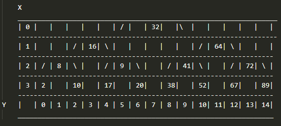

# Desenhar-arvoreBinaria
Explicando o código:

Função imprimir:

Foi implementado uma matriz dinâmica que aloca sequencialmente árvore. O eixo X, corresponde ao retorno da função "altura" + 1, pois a raiz inicial é desconsiderada pela função. Já o eixo Y, é calculado pela expressão (2h)-1, sendo h a altura, ele resulta na maior quantidade de folhas possíveis de acordo com a altura mais o espaçamento necessário para formação do desenho.

Exemplo:

Linha = (retorno função altura) + 1 => 4

Coluna = (2^ linha) - 1 => 15

Com esses valores a matriz é alocada dinamicamente e seus índices inicializados em -1. Após isso a função "alocar_pre_ordem" é chamada.

Função "alocar_pre_ordem":

A função recebe por referência  a raiz e a arvore, juntamente com os valores de linha, coluna e contadores (i e j). Por ser uma função recursiva, assim que se deparar com a falta de raiz (raiz == NULL), voltará para finalizar o chamamento anterior.

Continuando exemplo...

Parâmetros passados:

void alocar_pre_ordem(NoArv *raiz , int **arvore, int linha, int coluna, int i, int j)

NoArv *raiz = aponta para os números das raízes;

int **arvore = aponta para a matriz alocada dinamicamente;

int linha = 4;

int coluna = 15;

Obs.: linha e coluna sempre terão o mesmo valor no decorrer de uma impressão

int i = inicia em 0; 

int j = quando a função "alocar_pre_ordem" é chamada pela primeira vez tem o valor de: (coluna - 1) / 2, nas demais vezes: j = j - (2^linha-i-2), para raízes a esquerda e j = j + (2^linha-i-2) para raízes a direita;

Valores: raiz =  32 | linha = 4 | coluna = 15 | i = 0 | j = 7;

Passa pelo if (raiz == NULL), pois tem raiz (32)...

Alocado no posição: arvore[0][7] = 32 (confirme na matriz acima)...

Chamando para a raiz à esquerda essa mesma função:

Valores: raiz = 16 | linha = 4 |coluna = 15 | i = 1 | j = 3;

Passa pelo if (raiz == NULL), pois tem raiz (16)...

Alocado no posição: arvore[1][3] = 16 (confirme na matriz acima)...

Chamando para a raiz à esquerda essa mesma função:

Valores: raiz = 8; |linha = 4 | coluna = 15 | i = 2 | j = 1;

Passa pelo if (raiz == NULL), pois tem raiz (8)...

Alocado no posição: arvore[2][1] = 8 (confirme na matriz acima)...

Chamando para a raiz à esquerda essa mesma função:

Valores: raiz = 2; |linha = 4 | coluna = 15 | i = 3 | j = 0;

Passa pelo if (raiz == NULL), pois tem raiz (2)... 

Alocado no posição: arvore[3][0] = 2 (confirme na matriz acima)...

Chamando para a raiz à esquerda essa mesma função:

Sai da função, pois não passa pelo if (raiz == NULL), não tem raiz...

Volta para quando a raiz apontava para o número 8, para continuar a função...

Chamando para a raiz à direita essa mesma função:

Valores: raiz = 8; |linha = 4 | coluna = 15 | i = 2 | j = 1;

Passa pelo if (raiz == NULL), pois tem raiz (10)...

Alocado no posição: arvore[3][2] = 10 (confirme na matriz acima)...

Chamando para a raiz à esquerda essa mesma função...

E assim continuará até o fim da raízes e recursões.